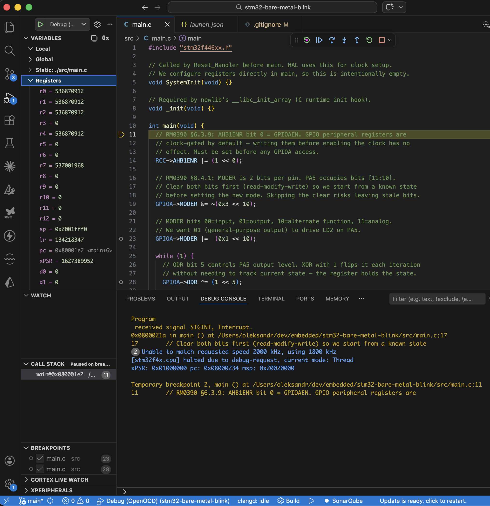

# stm32-bare-metal-blink

Bare-metal LED blink for the STM32 Nucleo-F446RE. No HAL, no CMSIS drivers — only direct register writes against RM0390.

PA5 (LD2) toggles at ~1 Hz using the 16 MHz HSI clock (default after reset).

## Hardware

- [NUCLEO-F446RE](https://www.st.com/en/evaluation-tools/nucleo-f446re.html) (STM32F446RETx, Cortex-M4)
- USB-A to Mini-B cable (powers the board and exposes ST-Link)

## What the code does

1. Enables the GPIOA clock via `RCC->AHB1ENR` (peripheral registers are clock-gated by default)
2. Configures PA5 as general-purpose output via `GPIOA->MODER`
3. Toggles `GPIOA->ODR` bit 5 in an infinite loop with a busy-wait delay

See `src/main.c` — every register write has an inline comment explaining why.

## Build

**Prerequisites**

```bash
brew install arm-none-eabi-gcc openocd cmake ninja
```

**Compile**

```bash
cmake -B build -G Ninja -DCMAKE_TOOLCHAIN_FILE=toolchain-arm-none-eabi.cmake
cmake --build build
```

Produces `build/blink.elf` and `build/blink.bin`.

## Flash

```bash
openocd -f interface/stlink.cfg -f target/stm32f4x.cfg \
  -c "program build/blink.elf verify reset exit"
```

## Debug

Open in VS Code. Install the [Cortex-Debug](https://marketplace.visualstudio.com/items?itemName=marus25.cortex-debug) extension, then press **F5**. The debugger connects via OpenOCD, resets the MCU, and halts at `main`.



## Project structure

```
├── src/main.c                  # application — register-level GPIO + busy-wait
├── startup_stm32f446xx.s       # Reset_Handler, vector table
├── STM32F446RETX_FLASH.ld      # linker script (flash + RAM regions from RM0390)
├── CMakeLists.txt              # build definition
├── toolchain-arm-none-eabi.cmake
└── include/                    # CMSIS device headers (ST-provided)
```
